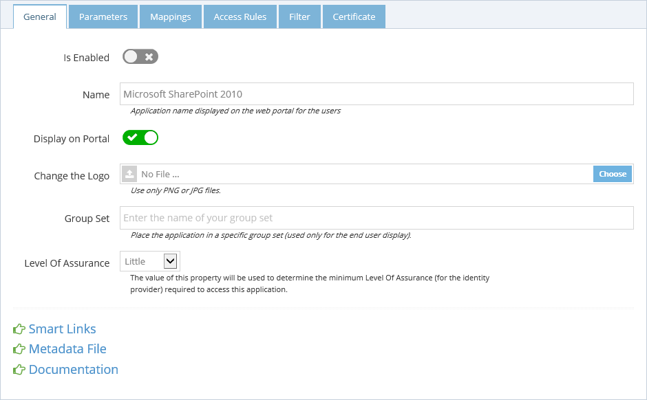
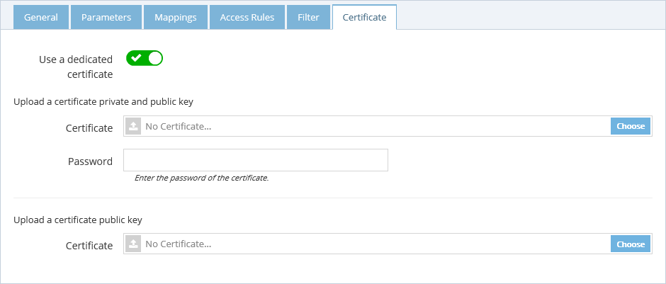
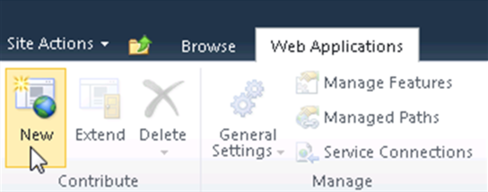
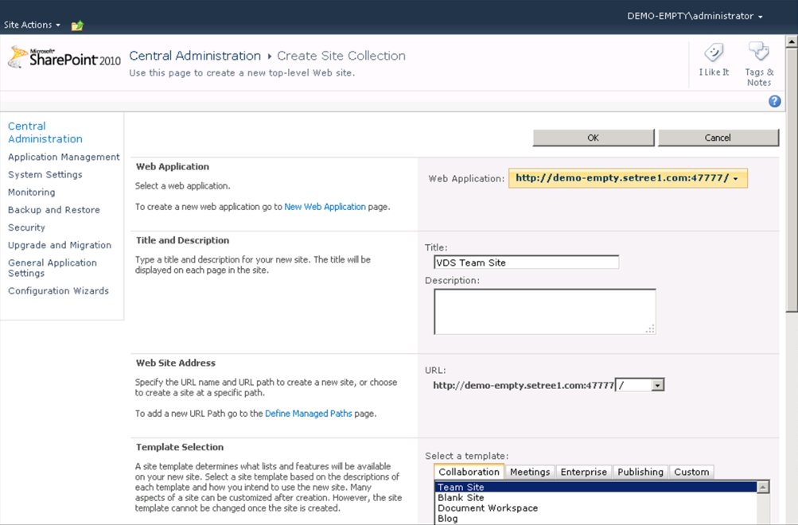
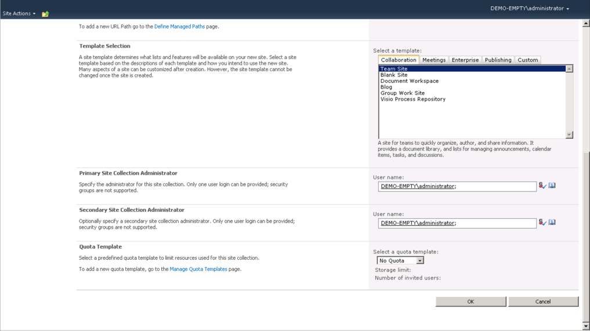
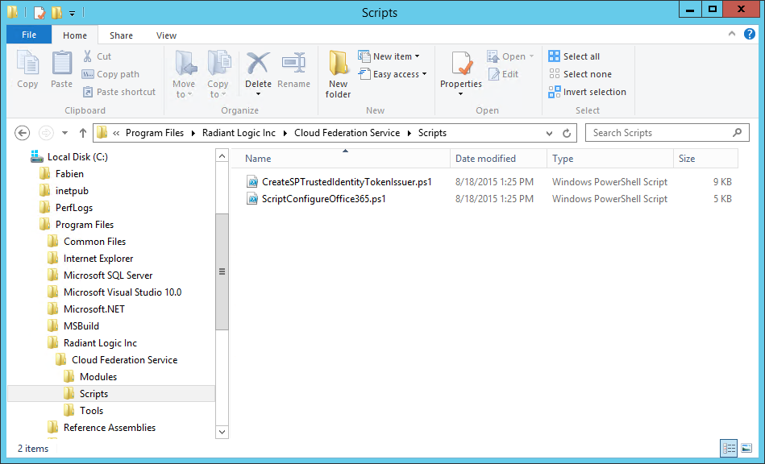
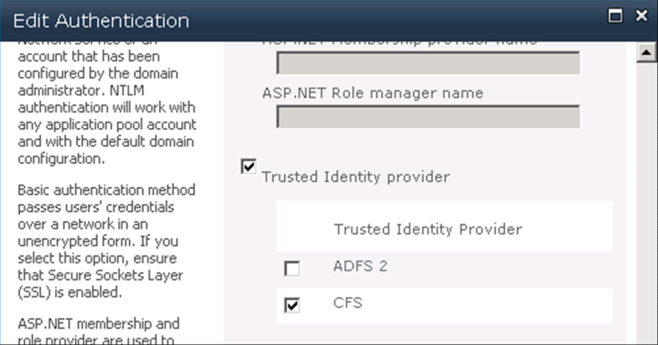
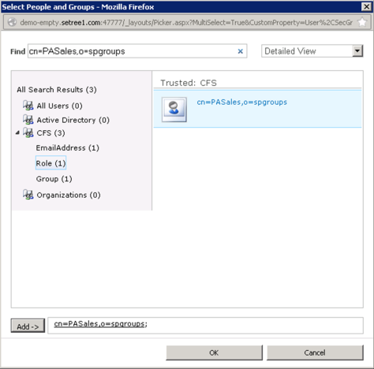
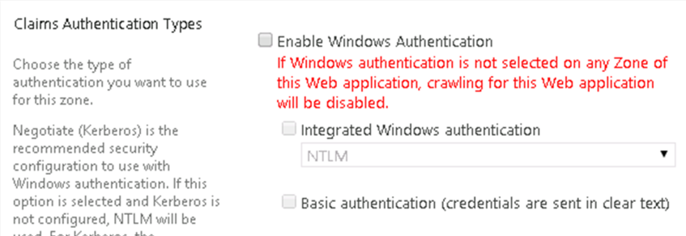

Microsoft SharePoint 2010
=========================

Return to [all applications](03-configuration#applications).

Create the application
----------------------

*   Log in as Tenant Administrator.
*   Navigate to Applications | Gallery.
*   Look for the application **Microsoft SharePoint 2010**
*   Click **Configure**.

Configuration in CFS
--------------------

### General

In the **General** tab you can define the general information of the application.

*   Enable the application.
*   Provide a name that will be displayed on the end user portal.
*   You can change the logo of the application.
*   The Group set is used to group the applications on the end user portal.
*   Set the application minimum [Level Of Assurance](../docs/getting-started/concepts.html#level-of-assurance).
*   Use the option Display on Portal to allow this application to appear on the end user portal or not.

The **Smart Links** link is used to configure [Smart Links](../docs/configuration/smartlinks.html) for this application.

You can also access directly the Metadata file by clicking the **Metadata File** link. This file might help you to configure the application (or service) side of this trust relationship.

### Parameters

The **Parameters** tab contains the list of settings required to configure the application.

*   **Realm** - Enter the Realm.
*   **Default Access** - Enter the default access URL.

*   **Signature Algorithm** - Algorithm to use to sign the token.
*   **Digest Algorithm** - Algorithm to use to generate the digest of the token.

### Mappings

The **Mappings** tab contains the list of transformation required to generate the output token claims. Since this application supports it, you can send additional claims in your token. Click the "New Mapping" button to add a new mapping.

The **Access Rules** tab helps define the second layer of security (after LOA) to grant access to this application. By default, the access is limited to only the people in the **Application Group** which is a group created automatically by CFS when the application is created. To grant access to this application you have 3 possibilities:

*   **Allow All Users** by checking this option, you will grant access to every user of your tenant (as long as the other security layers, LOA, COT... are accepted for the user).
*   Use the **Application Group** to add users allowed to access this application. The users who are granted access to the application after an access request are automatically added to this group.
*   Add **Additional groups** from the RadiantOne identity store.

### Filters

The **Filter** tab is another security layer that allows to filter the access to the application by using the context of the user. This context is based on the attributes of the user retrieved from the RadiantOne identity store and the attributes generated by CFS like the [Circle of Trust](../docs/getting-started/concepts.html#circle-of-trust).

### Certificate

The **Certificate** tab is used to define the certificate used by CFS to build the signature of the token it generates for the application. When configuring the application (or service), provide the public key of this certificate so the application can ensure that only CFS could have generated and signed the token. There are 3 options to provide this certificate to the application.

*   **Default Tenant Certificate** - CFS generates a certificate for each tenant and stores it the RadiantOne identity store. This is the default certificate that is used for all applications.
*   **Upload a private key** - You can upload your own certificate (private plus public key) and it will be used for this application only. This certificate is stored in the RadiantOne identity store, and can be used from any CFS machine.
*   **Upload a public key** - You can upload your own certificate (public key only). This public key is stored in the RadiantOne identity store, but the private key must be installed in the Windows Vault and made available on each CFS machine that will sign the application tokens. This is the most secure way to sign a token because the private key never travels on your network between the RadiantOne identity store and the CFS machines.

Configuring SharePoint
----------------------

### Create Web Application

It is assumed a web application/site does not currently exist in SharePoint. If it does, skip this section.

*   Open the SharePoint Central Administration Console, log in with your admin user and click  "Application Management".
*   Below the "Web Applications" section, click "Manage Web Applications.
*   Click the New Button.

*   Select "Claims Based Authentication" in the authentication section.
*   You can choose to create a new IIS website and set a unique port.
*   Typically, you should accept the default path.
*   In the Security Configuration section, you can leave the default options (Allow Anonymous=No, Use SSL=No).
*   In the Claims Authentication Types section, leave Enable Windows Authentication checked (you will later come back and enable CFS as a Trusted Identity Provider).

*   Leave the default sign in page option selected.
*   In the Public URL section, leave the default URL and Zone.
*   In the Application Pool section, you can choose to "Create new application pool" and choose the "Predefined" option for the security account. Select the Network Service predefined option.
*   Leave the default values for the Database Name and Authentication, Failover Server, Search Server, Service Application Connections, and Customer Experience Improvement Program sections.
*   Click OK to create the new site.
*   Since this is a new site, you will also need to setup a Site Collection. In the Application Management section, click Create Site Collections.

*   Make sure your application shows in the Web Application parameter (if not, click in the drop-down list to select a new one).
*   Enter a title description, web site address and choose a template.

*   Enter a primary and secondary site collection administrator.
*   Click OK.

### Create the Token Issuer

Use the SharePoint 2010 Management Shell available in the Start menu of the SharePoint machine under Microsoft SharePoint 2010 Products to configure SharePoint for CFS. This example maps the identifier as the email address and configures SharePoint to accept a role claim from CFS.

*   In the install folder of CFS, look for the script named `CreateSPTrustedIdentityTokenIssuer.ps1`.
*   Copy this file on the machine where SharePoint is installed.
*   Open the script with notepad (or Windows PowerShell ISE) and replace the parameters to match your configuration.
*   Execute the script.

### Set SharePoint IdP

After CFS has been configured as a trusted token issuer, as described in the previous section, the SharePoint site can be configured to use it. The steps below describe how to configure a SharePoint Web Application to use CFS as the Trusted Identity Provider.

*   Log into the SharePoint 2010 Central Administration Console and edit the site created in the previous section.
*   In the Application Management section, click Manage Web Applications.
*   Select your site and click "Authentication Providers".
*   Click the Zone that uses Claims Based Authentication.
*   In the Claims Authentication Types section, you should have a new Trusted Identity Provider to select from (from the commands issued in the Management Shell described above). Check this Trusted Identity Provider (e.g. CFS) and click Save.

### Site Permissions

After the SharePoint Web Application has been configured to use CFS as the authentication provider, configure permissions for the site based on claims returned in the token from CFS. This can be accomplished with the steps below.

*   Login to the site as an Administrator (or with a user that has been given full control) and then choose Site Actions -> Site Permissions from the top left corner.

*   Select a SharePoint group (e.g. FID Team Site Members) to add members to and click New > Add Users.

*   Click the icon to search for users and groups.
*   In this example, members of the FID Site Visitors will be based on the value of `cn=PAContractors,o=spgroups` or `cn=PASales,o=spgroups` coming in the role claim. Therefore, the search in People Picker will be based on these values. The Role claim below CFS (the trusted IdP) and the corresponding value is selected. Note that there is no ACTUAL search to data sources behind the scenes performed here. You have to know specifically what claims value you are expecting and WHAT claim will arrive in to properly set the permission.

 

*   After all claims values have been added, click OK.

Disabling Windows Authentication
--------------------------------

Now that the site is configured to trust CFS as the Identity Provider and permissions have been set, you can disable the Windows Authentication option for the site. This will allow for a better user experience by not having them choose between Windows Authentication and CFS when they first reach the SharePoint site (which they would have to if you have both Windows Authentication and a Trusted Identity Provider configured for authentication types of the site).

*   Log into the SharePoint 2010 Central Administration Console.
*   In the Application Management section, click Manage Web Applications.
*   Select your site and click "Authentication Providers".
*   Click the Zone that uses Claims Based Authentication.
*   In the Claims Authentication Types section, uncheck the Enable Windows Authentication and click Save.

