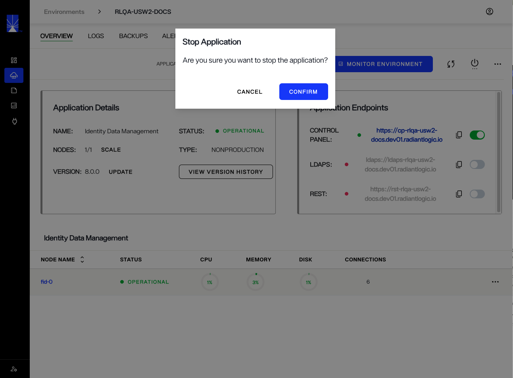
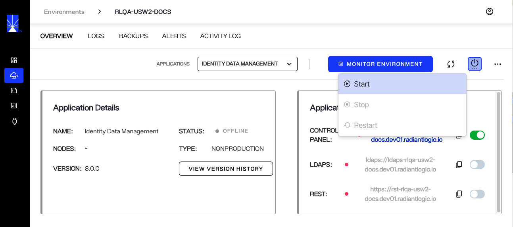

---
keywords:
title: Stop an Environment
description: Learn how to stop an environment in Environment Operations Center.
---
# Stop an Environment

This guide outlines the required steps to stop an environment while on the *Environments* home screen in Environment Operations Center.
<!-- For information on deleting an environment from its detailed view, see the [delete an environment from its detailed view](../environment-details/delete-environment.md) guide. -->

> [!note] Only non-production environments can be stopped by users. To stop a production environment, please contact Radiant Logic.

## Select the environment

From the *Environments* home screen, locate the environment you would like to stop from the list of environments. Go the specific environment and  on the right top corner, clic on the power icon

From the list of options elect **STOP** to stop the environment

> [!note] When an environment is stopped, no data is lost. The environment can be started back to the state before it was stopped.

A pop up appears asking to confirm Stopping the environment, click **CONFIRM** to stop the environment, or click **CANCEL** to cancel the operation and go back.

On the environment overview page, you can see a message **Stopping environment**

When the environment is successfully stopped, the status on the overview page changes to **OFFLINE**

## Start environment

> [!note] Starting an environment is only available when a environment is created and stopped.

To start the selected environment, on the overview page, right top corner, click on the power icon

From the options under power, select the **Start**

A pop up appears asking to confirm the **Start Environment**, click on **Confirm** to start the environment or to go back, click **Cancel**

A message appears on the environment overview screen, **Starting environment**

> [!note] The environment **START** process may take up to 10 minutes.

## Confirmation

After a successful, restart of the environment, status of the environment turns to **OPERATIONAL** on the environment overview screen

