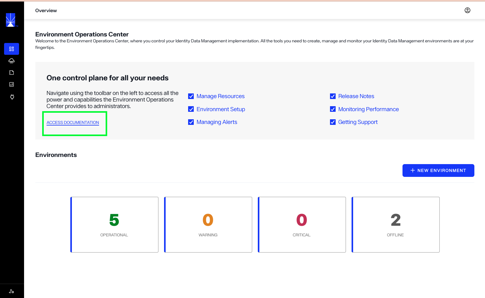
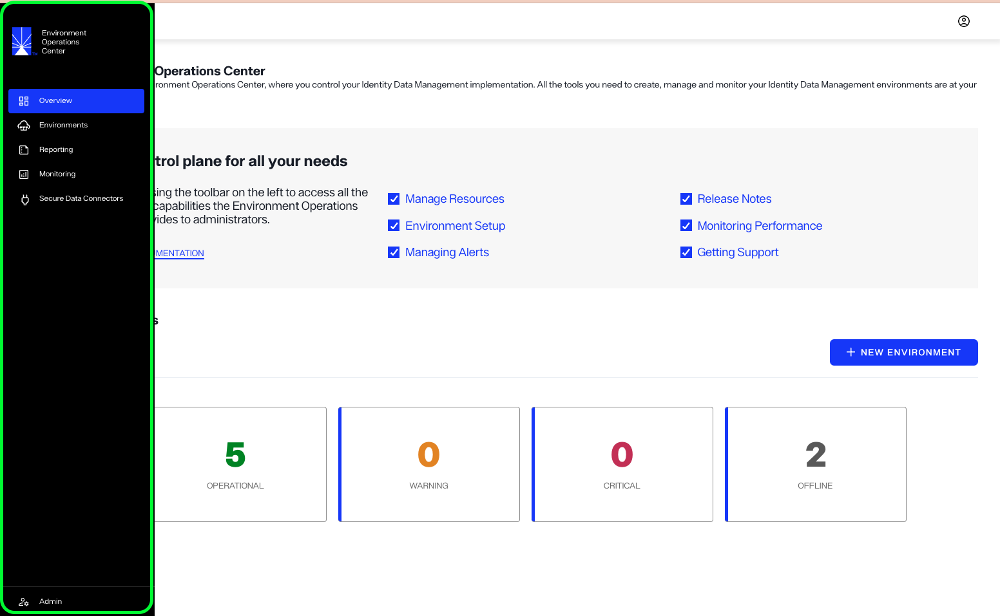
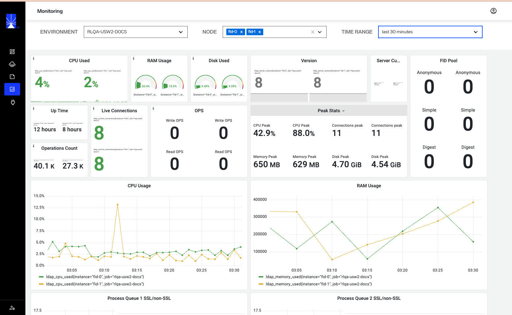
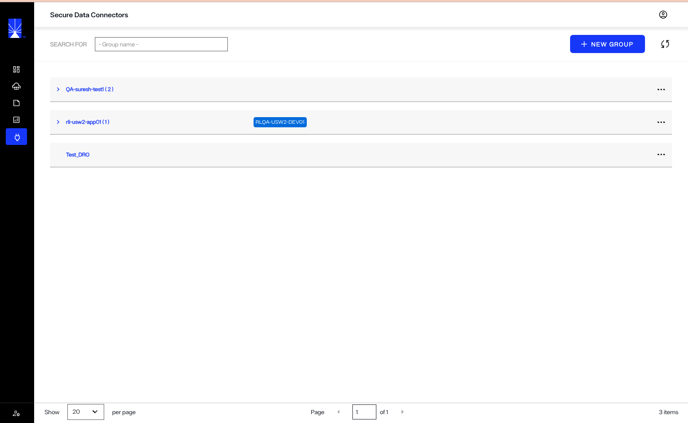
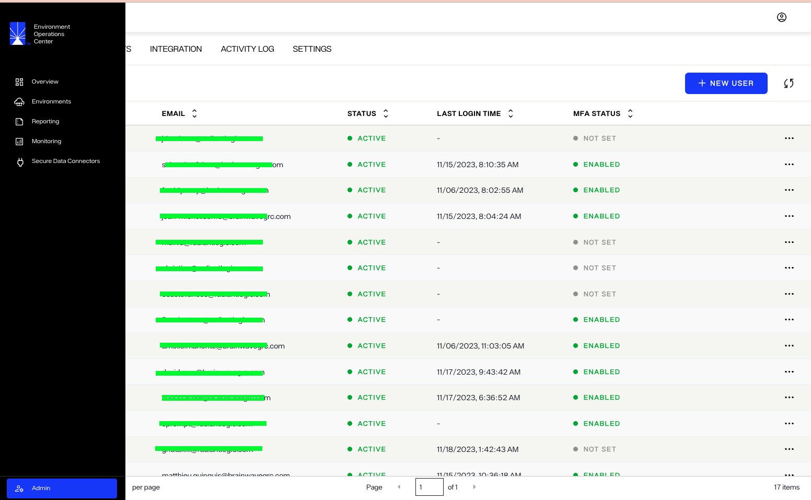

---
keywords:
title: Getting Started
description: Get a quick introduction to the Environment Operations Center including how to view and manage environments, access the reporting and monitoring sections, configuring secure data connectors, and performing administrative functions.
---
# Getting Started

Environment Operations Center allows you to control your RadiantOne implementation in a cloud environment. It provides all of the required tools to create, manage, and monitor your RadiantOne environments. 

This guide provides an overview of the Environment Operations Center home screen and how to navigate the application user interface.

## Overview

After logging in to the Environment Operations Center, the *Overview* screen appears. This is the Env Ops Center home screen and provides access to Radiant Logic supporting documentation. This screen also provides a high-level overview of your environments. 

A navigation bar is located to the left and is visible from all screens within Environment Operation Center. You can access your account settings by selecting the avatar in the upper right corner, also visible from all screens in the application.

### Documentation

The Radiant Logic documentation suite contains guides and resources to help your work in RadiantOne and Environment Operations Center.

To access supporting documentation from within Environment Operations Center, select **Access Documentation**.

### Environments preview

The *Environments* section on the *Overview* screen allows you to quickly preview your available environments and sort the previews by status.

Each environment preview contains the environment name, type, status, number of nodes, and version number.

The environments displayed differ depending on your assigned role in Environment Operations Center. The Tenant Administrator environment preview displays all of your organization's environments. Environment Administrators and Environment Users will only be able to preview the environments assigned to them.

For further details on role-based permissions, see the [role-based permissions](../admin/role-based-permission/role-based-permissions.md) guide.

#### Filter environments

A status count displays how many environments have a status of "Critical", "Warning", and "Operational".

To filter the displayed environments by status, select a status card. For example, selecting "Critical" will update the *Environments* section to only display environments with "Outage" statuses.

#### Manage environments

Each environment preview contains an **Options** (**...**) menu that allows you to access further details about the environment or delete it. Dropdown menu options include:

- View Details: Navigate to the detailed screen of the environment to view additional information.
- Adjust Scale: Increase or decrease the number of nodes in the environment.
- View Logs: Navigate to the logs tab for the environment.
- Delete: Begin the workflow to delete the environment.

To learn more about each of these actions, review the [environment details](../environments/environment-details/environment-overview.md) overview, the [logs](../environments/logging/environment-logs.md) guide, or the guide to [delete an environment](../environments/environment-details/delete-environment.md).

## Left navigation

The left navigation contains links to various screens, providing access Environment Operation Center features.

### Overview

To navigate to the *Overview* screen, select either **Overview** or the Radiant Logic logo.

### Environments

The main *Environments* screen provides an overview of all the environments you have access to. Select **Environments** to navigate to the *Environments* overview.

To learn more about the *Environments* section, see the [environments overview](../environments/environment-overview/environments-overview.md) guide.

### Reporting

The *Reporting* section allows you to run and review various reports for your environments. Select **Reporting** to navigate to the *Reporting* screen.

To learn how to create reports, see the [reporting](../reporting/reporting-overview.md) guide.

### Monitoring

The *Monitoring* section provides interactive dashboards where you can review the operating status of various server components for each environment. Select **Monitoring** to navigate to the *Monitoring* section of Environment Operations Center.

For details on monitoring server components, see the [monitoring](../monitoring/monitoring-overview.md) guide.

### Secure data connectors

You can manage connections to on-premise data connectors in the *Secure Data Connectors* section. Select **Secure Data Connectors** to navigate to the *Secure Data Connectors* screen.

For details on managing data connections, see the [secure data connectors](../secure-data-connectors/data-connectors-overview.md) guide.

### Admin

From the *Admin* section you can perform various administrative actions in Environment Operations Center. Select **Admin** to navigate to the *Admin* home screen.

For further details on operations available in the *Admin* section, see the [admin overview](admin/admin-overview.md) guide.

## Account settings

A user avatar is always located in the upper right corner of the Env Ops Center user interface. Select the avatar to expand your account dropdown menu. 

The dropdown displays your name, email, and permissions associated with the account. From the dropdown menu you can navigate to your **Account Settings**, access the **Help** center, or **Logout** of Env Ops Center.

For information on managing your account settings, see the [account settings](../admin/account-settings/update-account.md) guide.

## Next steps

After reading this guide you should have an understanding of the *Overview* screen components and how to navigate the Environment Operations Center user interface. For more information on environments, see the [environments overview](../environments/environment-overview/environments-overview.md) guide. To learn how to create an environment, see the [create an environment](../environments/environment-overview/create-an-environment.md) guide.
